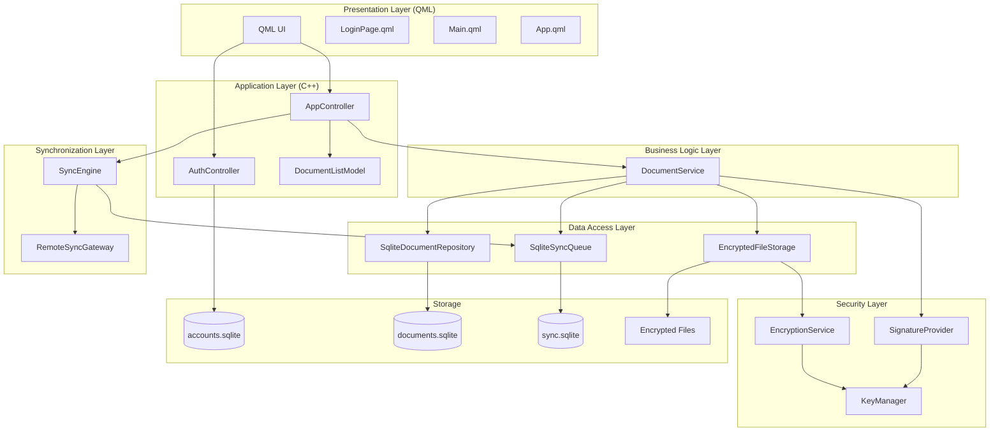
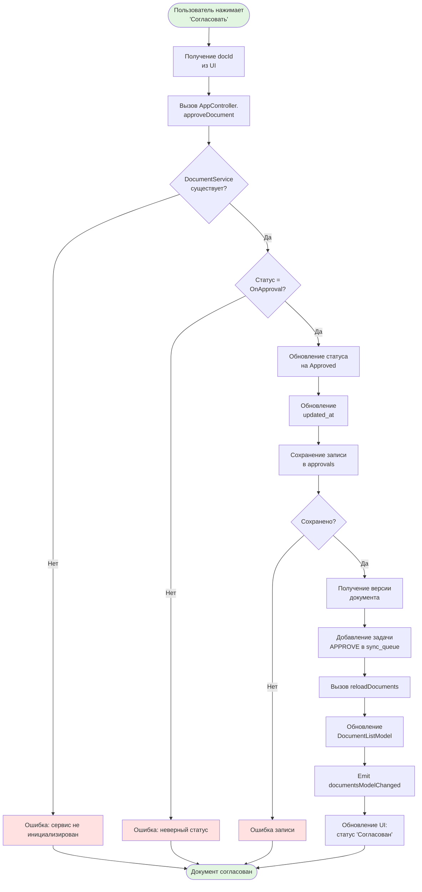
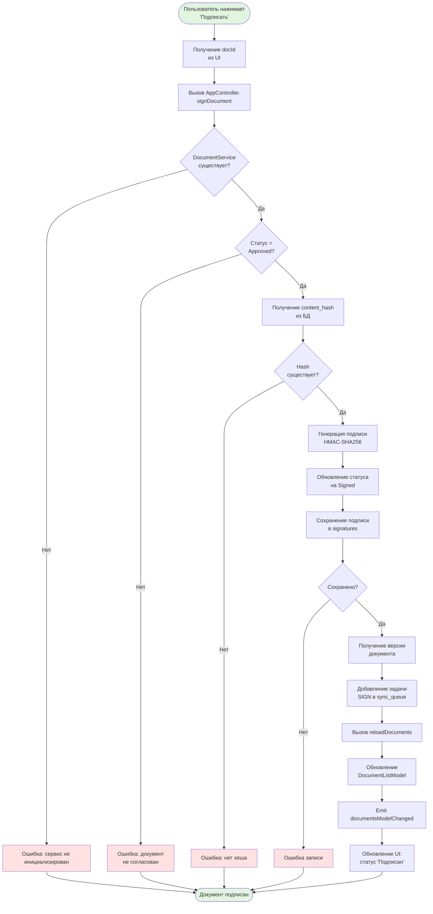
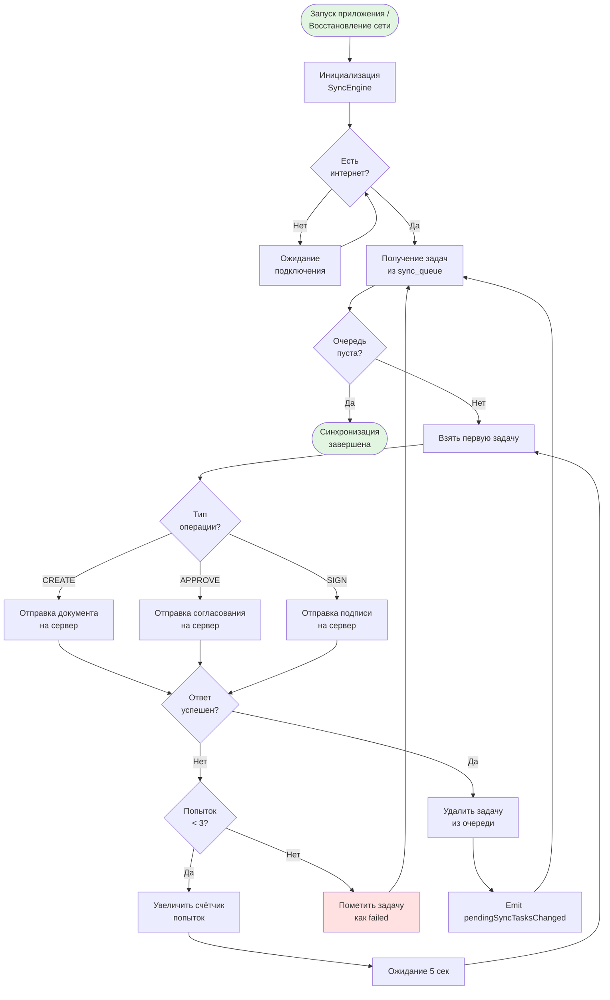
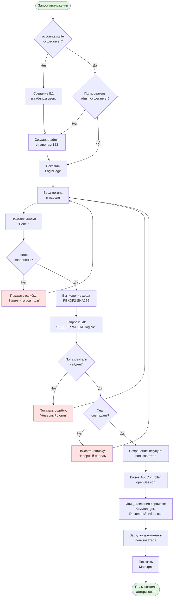
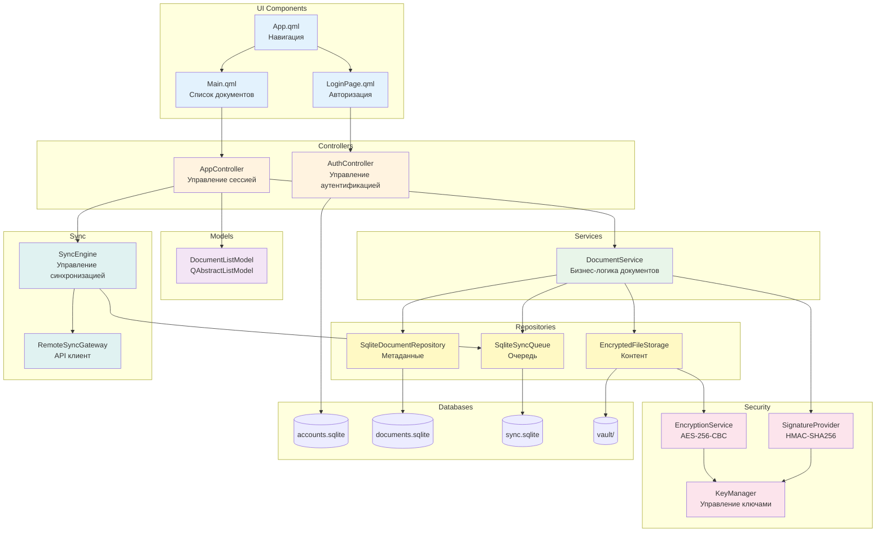
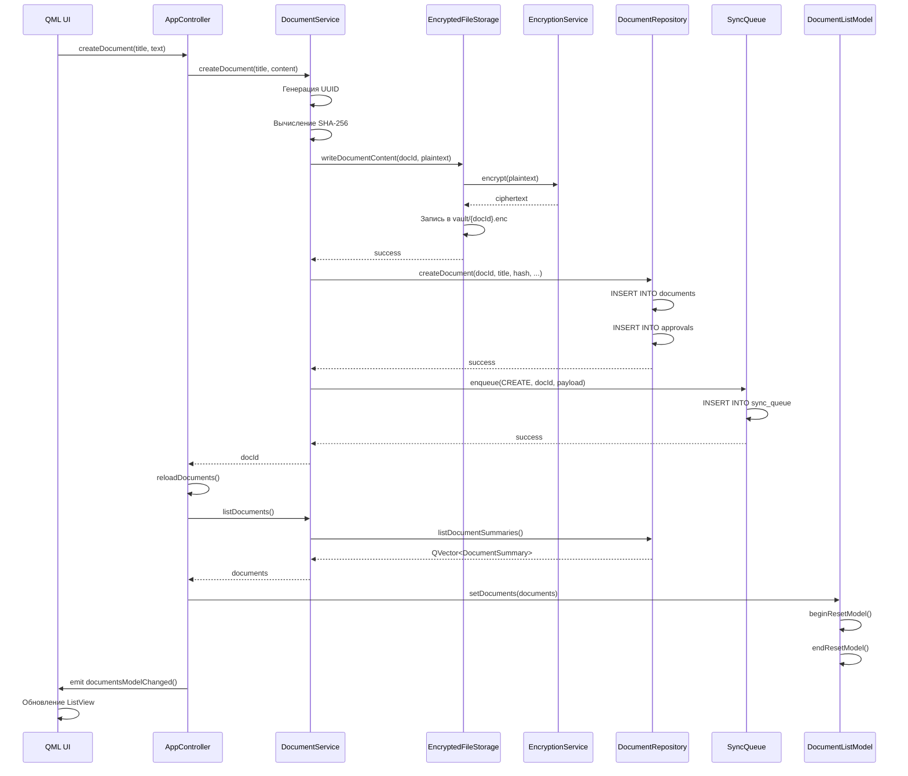

# Архитектура системы Offline EDM

## Содержание
1. [Общая архитектура системы](#общая-архитектура-системы)
2. [Декомпозиция по слоям](#декомпозиция-по-слоям)
3. [Блок-схема создания документа](#блок-схема-создания-документа)
4. [Блок-схема согласования документа](#блок-схема-согласования-документа)
5. [Блок-схема подписания документа](#блок-схема-подписания-документа)
6. [Блок-схема синхронизации](#блок-схема-синхронизации)
7. [Блок-схема аутентификации](#блок-схема-аутентификации)
8. [Диаграмма компонентов](#диаграмма-компонентов)

---

## Общая архитектура системы



---

## Декомпозиция по слоям

### 1. Presentation Layer (Слой представления)
**Технология:** QML + Qt Quick  
**Ответственность:** Отображение UI, обработка пользовательского ввода

| Компонент | Файл | Назначение |
|-----------|------|------------|
| App | `App.qml` | Корневой компонент, управление навигацией |
| LoginPage | `LoginPage.qml` | Страница авторизации |
| Main | `Main.qml` | Главная страница с документами |

### 2. Application Layer (Слой приложения)
**Технология:** C++ Qt  
**Ответственность:** Координация между UI и бизнес-логикой

| Компонент | Файлы | Назначение |
|-----------|-------|------------|
| AuthController | `AuthController.h/cpp` | Управление аутентификацией |
| AppController | `AppController.h/cpp` | Управление сессией, документами |
| DocumentListModel | `DocumentListModel.h/cpp` | Модель данных для QML ListView |

### 3. Business Logic Layer (Слой бизнес-логики)
**Технология:** C++  
**Ответственность:** Реализация бизнес-правил

| Компонент | Файлы | Назначение |
|-----------|-------|------------|
| DocumentService | `DocumentService.h/cpp` | Операции с документами (CRUD, approve, sign) |

### 4. Security Layer (Слой безопасности)
**Технология:** C++ + Qt Cryptography  
**Ответственность:** Шифрование, подписи, управление ключами

| Компонент | Файлы | Назначение |
|-----------|-------|------------|
| KeyManager | `KeyManager.h/cpp` | Управление криптографическими ключами |
| EncryptionService | `EncryptionService.h/cpp` | Шифрование/дешифрование данных (AES-256) |
| SignatureProvider | `SignatureProvider.h/cpp` | Создание цифровых подписей (HMAC-SHA256) |

### 5. Data Access Layer (Слой доступа к данным)
**Технология:** C++ + SQLite  
**Ответственность:** Хранение и извлечение данных

| Компонент | Файлы | Назначение |
|-----------|-------|------------|
| SqliteDocumentRepository | `SqliteDocumentRepository.h/cpp` | Работа с метаданными документов |
| EncryptedFileStorage | `EncryptedFileStorage.h/cpp` | Хранение зашифрованного контента |
| SqliteSyncQueue | `SqliteSyncQueue.h/cpp` | Очередь задач синхронизации |

### 6. Synchronization Layer (Слой синхронизации)
**Технология:** C++ + Qt Network  
**Ответственность:** Синхронизация с удалённым сервером

| Компонент | Файлы | Назначение |
|-----------|-------|------------|
| SyncEngine | `SyncEngine.h/cpp` | Управление процессом синхронизации |
| RemoteSyncGateway | `RemoteSyncGateway.h/cpp` | Взаимодействие с удалённым API |

### 7. Storage (Хранилище)
**Технология:** SQLite + File System  
**Ответственность:** Персистентное хранение данных

| Хранилище | Расположение | Содержимое |
|-----------|--------------|------------|
| accounts.sqlite | `%APPDATA%/offline-edm/offline-edm/` | Учётные записи пользователей |
| documents.sqlite | `%APPDATA%/offline-edm/offline-edm/users/{login}/` | Метаданные документов |
| sync.sqlite | `%APPDATA%/offline-edm/offline-edm/users/{login}/` | Очередь синхронизации |
| vault/ | `%APPDATA%/offline-edm/offline-edm/users/{login}/vault/` | Зашифрованные файлы |

---

## Блок-схема создания документа

```mermaid
flowchart TD
    Start([Пользователь нажимает<br/>'Создать документ']) --> Input[Ввод названия<br/>и содержимого]
    Input --> CallCreate[Вызов AppController.<br/>createDocument]
    CallCreate --> CheckService{DocumentService<br/>существует?}
    CheckService -->|Нет| ErrorService[Ошибка: сервис не инициализирован]
    CheckService -->|Да| GenID[Генерация UUID<br/>для документа]
    
    GenID --> CalcHash[Вычисление SHA-256<br/>хеша контента]
    CalcHash --> Encrypt[Шифрование контента<br/>AES-256-CBC]
    Encrypt --> SaveFile[Сохранение в<br/>vault/{docId}.enc]
    SaveFile --> CheckFile{Файл<br/>сохранён?}
    CheckFile -->|Нет| ErrorFile[Ошибка записи файла]
    CheckFile -->|Да| SaveMeta[Сохранение метаданных<br/>в documents.sqlite]
    
    SaveMeta --> CheckMeta{Метаданные<br/>сохранены?}
    CheckMeta -->|Нет| ErrorMeta[Ошибка записи в БД]
    CheckMeta -->|Да| CreateApproval[Создание записи<br/>в approvals]
    CreateApproval --> AddToQueue[Добавление задачи<br/>в sync_queue]
    AddToQueue --> Reload[Вызов reloadDocuments]
    Reload --> UpdateModel[Обновление<br/>DocumentListModel]
    UpdateModel --> EmitSignal[Emit documentsModelChanged]
    EmitSignal --> UpdateUI[Обновление UI]
    UpdateUI --> End([Документ создан])
    
    ErrorService --> End
    ErrorFile --> End
    ErrorMeta --> End
    
    style Start fill:#e1f5e1
    style End fill:#e1f5e1
    style ErrorService fill:#ffe1e1
    style ErrorFile fill:#ffe1e1
    style ErrorMeta fill:#ffe1e1
```

---

## Блок-схема согласования документа



---

## Блок-схема подписания документа



---

## Блок-схема синхронизации



---

## Блок-схема аутентификации



---

## Диаграмма компонентов



---

## Взаимодействие компонентов при создании документа



---

## Ключевые технологии и паттерны

### Архитектурные паттерны
- **Layered Architecture** - разделение на слои (Presentation, Application, Business, Data)
- **Repository Pattern** - абстракция доступа к данным
- **Service Layer** - инкапсуляция бизнес-логики
- **Model-View-Controller (MVC)** - разделение UI и логики

### Паттерны проектирования
- **Dependency Injection** - через конструкторы сервисов
- **Observer Pattern** - Qt Signals/Slots для уведомлений
- **Strategy Pattern** - различные провайдеры (Signature, Encryption)
- **Queue Pattern** - очередь синхронизации

### Технологии безопасности
- **AES-256-CBC** - симметричное шифрование контента
- **PBKDF2-SHA256** - хеширование паролей (100,000 итераций)
- **HMAC-SHA256** - цифровые подписи документов
- **Key Derivation** - генерация ключей из мастер-пароля

### Технологии хранения
- **SQLite** - реляционная БД для метаданных
- **File System** - хранение зашифрованных файлов
- **JSON** - сериализация данных синхронизации

---

## Потоки данных

### Поток создания документа
```
Пользователь → QML → AppController → DocumentService → 
→ EncryptedFileStorage → vault/{docId}.enc
→ SqliteDocumentRepository → documents.sqlite
→ SqliteSyncQueue → sync.sqlite
→ DocumentListModel → QML → Пользователь
```

### Поток синхронизации
```
SyncEngine → SqliteSyncQueue → RemoteSyncGateway → 
→ Удалённый сервер (MVP: local JSON)
→ SqliteSyncQueue (удаление задачи)
→ AppController (emit pendingSyncTasksChanged)
→ QML (обновление счётчика)
```

### Поток аутентификации
```
Пользователь → LoginPage → AuthController → 
→ accounts.sqlite (проверка credentials)
→ AppController.openSession()
→ Инициализация сервисов
→ Main.qml
```

---

## Метрики системы

| Метрика | Значение |
|---------|----------|
| Количество слоёв | 7 |
| Количество компонентов | 18 |
| Количество БД | 3 |
| Алгоритмы шифрования | AES-256-CBC |
| Алгоритмы подписи | HMAC-SHA256 |
| Алгоритмы хеширования | PBKDF2-SHA256, SHA-256 |
| Язык программирования | C++20 |
| UI фреймворк | Qt 6 QML |
| Система сборки | CMake 3.22+ |

---

## Примечания по безопасности

1. **Шифрование данных**: Все файлы документов хранятся в зашифрованном виде (AES-256-CBC)
2. **Хеширование паролей**: Пароли хешируются с использованием PBKDF2-SHA256 (100,000 итераций)
3. **Цифровые подписи**: Документы подписываются с использованием HMAC-SHA256
4. **Изоляция данных**: Каждый пользователь имеет отдельную БД и vault
5. **Offline-first**: Система работает без интернета, синхронизация происходит при восстановлении связи

---

## Масштабируемость

### Горизонтальное масштабирование
- Каждый пользователь имеет изолированное хранилище
- Синхронизация через очередь задач
- Возможность добавления нескольких серверов синхронизации

### Вертикальное масштабирование
- SQLite поддерживает до 281 TB данных
- Файловая система ограничена только размером диска
- Очередь синхронизации может содержать миллионы задач

---

*Документ создан: 2026-05-18*  
*Версия: 1.0*
